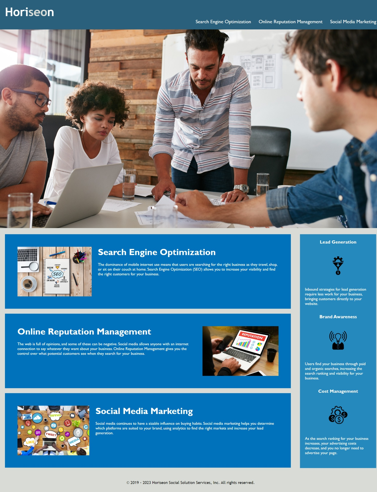

# Accessibility and Design modification

## Description

This README provides an overview of the modifications made to the codebase to address the ticket. It highlights the key changes and improvements implemented.

## Table of Contents

If your README is long, add a table of contents to make it easy for users to find what they need.

- [Modifications](#modifications)
- [Usage](#usage)
- [Development](#development)
- [Credits](#credits)
- [License](#license)
- [Conclusion](#conclusion)

## Modifications

The following modifications were made to the codebase to meet the given requirements and improve the overall quality of the webpage:

1. <strong>Ensured Accessibility Standards:</strong>

- Reviewed the source code and implemented semantic HTML elements to enhance accessibility.
- Verified that the HTML elements follow a logical structure independent of styling and positioning.
- Added accessible alt attributes to icon and image elements to improve usability for assistive technologies.
- Ensured heading attributes are in sequential order for proper document structure.
Updated the title element to provide a concise and descriptive title for the webpage.

2. <strong>Code Refactoring and Organization:</strong>

- Consolidated and organized CSS selectors and properties to follow a semantic structure.
- Implemented proper commenting in the CSS file to improve code readability and maintainability.

3. <strong>Following the Scout Rule:</strong>

- Adhered to the Scout Rule by leaving the code cleaner than when it was initially found.
- Conducted code cleanup and formatting to enhance code quality and readability.

    <strong>Additional Achievements:</strong>

In addition to meeting the specified requirements, the following improvements were implemented:

- Verified that all navigation elements within the application function correctly.
- Conducted a comprehensive review of the CSS file and ensured that selectors and properties are properly organized and consolidated.
- Added comments to the CSS file for better documentation and ease of maintenance.
- Added extra media query for different width.

By making these modifications and improvements, the webpage now adheres to accessibility standards, has a logical structure, and follows best practices for code organization and cleanliness.

## Usage

Demo of Marketing Agency Website. Currently, the only interactive portion is the horizontal navigation bar on the top, by clicking it takes you to appointed location on the webpage.

## Development

### Folder Structure

three major files of this project are the [Index.html](https://github.com/arsalanbardsiri/arsalan-module-1-challeng-uci-bootcamp/blob/main/index.html) which contains the structure,[style.css](https://github.com/arsalanbardsiri/arsalan-module-1-challeng-uci-bootcamp/blob/main/assets/css/style.css) for styling purposes. All the used graphics are from the images [folder](https://github.com/arsalanbardsiri/arsalan-module-1-challeng-uci-bootcamp/tree/main/assets/images).

### Built With

## Credits

N/A

## License

Please refer to the LICENSE in the repository.

## Conclusion

<strong>In conclusion, the modifications made to the existing code include:</strong>

1. Implementation of semantic HTML elements to improve the accessibility and structure of the webpage.
2. Addition of alt attributes to the icon and image elements for better accessibility.
3. Ensuring a logical structure of HTML elements independent of styling and positioning.
4. Reordering the heading attributes to follow a sequential order.
5. Providing a concise and descriptive title for the webpage.
6. Consolidation and organization of CSS selectors and properties to follow a semantic structure.
7. Proper commenting of the CSS file for better code readability and maintainability.
8. Addition of media queries to ensure responsiveness and consistent styling on different screen sizes.
9. Following the Scout Rule by leaving the code in a cleaner state than before.

These modifications have improved the overall accessibility, structure, and visual appeal of the webpage while maintaining proper coding practices. The application's links function correctly, and the CSS file is well-organized and documented. These enhancements ensure a better user experience and make the codebase more maintainable in the long run.

